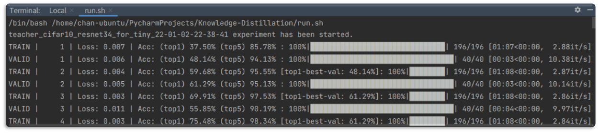
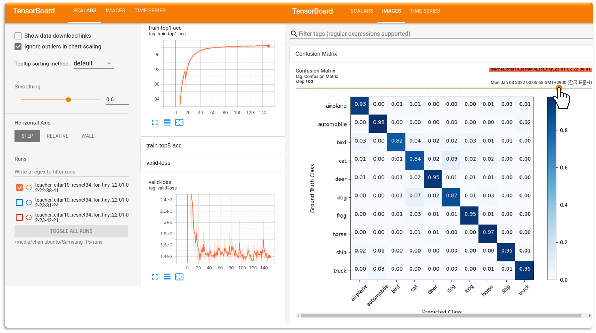

# Simple-Image-Classification
## Simple Image Classification Code (PyTorch)
[Yechan Kim*](https://github.com/unique-chan) and [Junggyun Oh*](https://github.com/Dodant)

### This repository contains:
- Python3 / Pytorch code for multi-class image classification


### Prerequisites
- See `requirements.txt` for details.
~~~ME
torch
torchvision
matplotlib
scikit-learn
tqdm            # not mandatory but recommended
tensorboard     # not mandatory but recommended
~~~


### How to use
1. The directory structure of your dataset should be as follows. (You can use our toy-examples: unzip `cifar10_dummy.zip`.)
~~~
|—— 📁 your_own_dataset
	|—— 📁 train
		|—— 📁 class_1
			|—— 🖼️ 1.jpg
			|—— ...
		|—— 📁 class_2 
			|—— 🖼️ ...
	|—— 📁 valid
		|—— 📁 class_1
		|—— 📁 ... 
	|—— 📁 test
		|—— 📁 class_1
		|—— 📁 ... 
~~~

2. Check **__init__.py**. You might need to modify variables and add somethings (transformation, optimizer, lr_schduler ...).
💁 `Tip` You can add your own loss function as follows: 
```python
...
def get_loss_function(loss_function_name, device):
    ... 
    elif loss_function_name == 'your_own_function_name':  # complement cross entropy (PRL)
        return your_own_function()
    ...
...
```

3. Run **train.py** for training. The below is an example. See **src/my_utils/parser.py** for details.
💁 `Tip` `--loss_function='CE'` means that you choose softmax-cross-entropy (default) for your loss.
~~~ME
python train.py --network_name='resnet34_for_tiny' --dataset_dir='./cifar10_dummy' \
--batch_size=256 --epochs=5  \
--lr=0.1 --lr_step='[60, 120, 160]' --lr_step_gamma=0.5 --lr_warmup_epochs=5 \
--auto_mean_std --store_weights --store_loss_acc_log --store_logits --store_confusion_matrix \
--loss_function='your_own_function_name' --transform_list_name='CIFAR' --tag='train-001'
~~~


4. Run **test.py** for test. The below is an example. See **src/my_utils/parser.py** for details.
~~~ME
python test.py --network_name='resnet34_for_tiny' --dataset_dir='./cifar10_dummy' \
--auto_mean_std --store_logits --store_confusion_matrix \
--checkpoint='pretrained_model_weights.pt'
~~~

### Trailer
1. If you install tqdm, you can check the progress of training.


2. If you install tensorboard, you can check the acc/loss changes and confusion matrix during training.



### Contribution
🐛 If you find any bugs or have opinions for further improvements, feel free to contact us (yechankim@gm.gist.ac.kr or maestr.oh@gm.gist.ac.kr). All contributions are welcome.


### Reference
1. https://github.com/weiaicunzai/pytorch-cifar100
2. https://github.com/peterliht/knowledge-distillation-pytorch
3. https://medium.com/@djin31/how-to-plot-wholesome-confusion-matrix-40134fd402a8 (Confusion Matrix)
